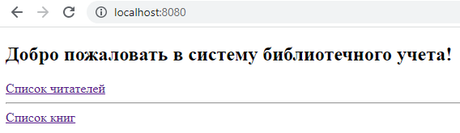
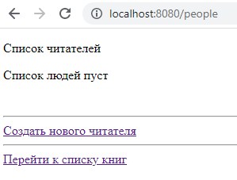
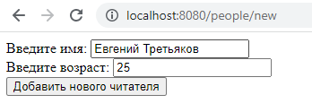
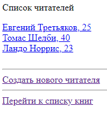
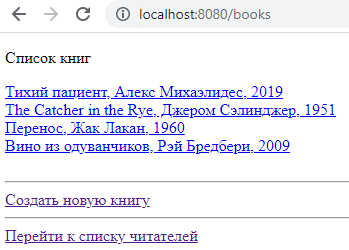
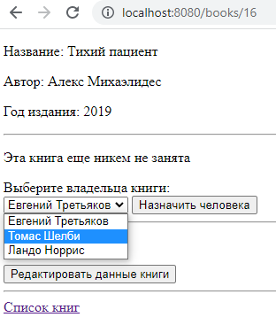
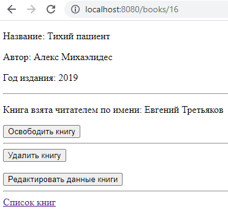
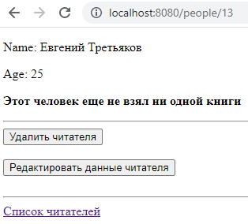
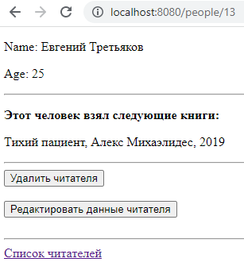
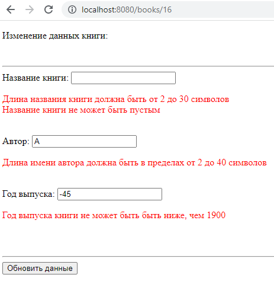

# Book Registry System

<p align="center">
    
</p>


### Используемый стэк технологий:

* JDK 18;
* Maven;
* Spring Core;
* Spring MVC (web-функционал);
* Spring DATA Jdbc (работа с БД);
* PostgreSQL.

### Описание:

* Система библиотечного учета читателей и книг, с помощью которой можно создавать, добавлять и удалять читателей и
  книги;
* На странице каждого читателя предоставлена информацию о взятых им книгах;
* На странице книги имеется возможность назначить ее любому из зарегистрированных читателей или освободить ее;
* Для создания или редактирования информации о читателе или книге должны выполняться предъвляемые требования (Уникальное
  имя читателя, верный возраст, допустимое название книги, год издания и т.д.);

<p align="center">
    
p>

Рисунок 1 - Приветственная страница
<p align="center">

</p>
Рисунок 2 - Пустой список читателей
<p align="center">

</p>
Рисунок 3 - Форма создания читателя 

<p align="center">

</p>
Рисунок 4 - Список читателей после добавления в реестр

<p align="center">

</p>
Рисунок 5 - Список книг после добавления в реестр

<p align="center">

</p>
Рисунок 6 - Страница книги, когда она никем не взята (с возможностью выбора читателя из списка зарегистрированных)

<p align="center">

</p>
Рисунок 7 - Страница книги, взятой читателем

<p align="center">

</p>
Рисунок 8 - Страница читателя до взятия книги

<p align="center">

</p>
Рисунок 9 - Страница человека, когда ему была присвоена книга

<p align="center">

</p>
Рисунок 10 - Предупреждение на странице редактирования информации о книге после ввода неверных данных  

### Условия для запуска:

* Для запуска требуется веб-сервер Tomcat версии 9.0.73 или более ранняя версия;
* Настройки для соединения с БД находятся в файле ```src/main/resources/database.properties```;
* Для создания таблиц можно воспользоваться SQL-скриптами из ```materials/fillDatabase.sql```;

### Запуск:

* В Intellij IDEA: Run -> Edit Configurations -> выбрать Tomcat Local:

1) Настроить сервер (указать путь до папки с Tomcat);
2) Во вкладке `Deployment` добавить war-exploded архив, а также указать пустой графу Application Context. После этого
   можно запускать сервер через Intellij IDEA;
3) По адресу ```http://www.localhost:8080/``` будет находиться приветственная страница проиложения